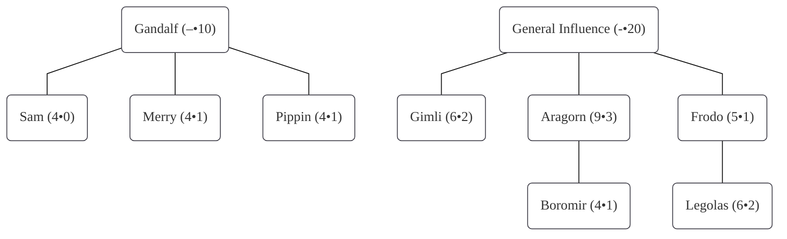

  

   CONTENTS
  

  {: .text-gamma }
- TOC
{:toc}

  

    NOTES 
  

  {: .text-gamma }
  
{: .counsel }
> These archived rules include minor emendations correcting typographical, clerical, and typesetting issues in the original text. Such corrections are <b>not</b> annotated. 

---

# MIDDLE-EARTH: THE WIZARDS RULESBOOK

{: .text-center }
***"Do not meddle in the affairs of wizards&mdash;*** 
***for they are subtle and quick to anger."***

{: .text-center }
## CONTENTS

|    &emsp; [USING THIS RULESBOOK](/rules-archive/the-wizards-limited#using-this-rulesbook)     &emsp; [PLAYER TURN SUMMARY](/rules-archive/the-wizards-limited#player-turn-summary)     &emsp; [PLAYER NOTES](/rules-archive/the-wizards-limited#player-notes)     **PART I — THE STARTER RULES**     &emsp; [1 • THE VICTORY CONDITIONS](/rules-archive/the-wizards-limited#1--the-victory-conditions)     &emsp; [2 • THE CARDS AND DECKS](/rules-archive/the-wizards-limited#2--the-cards-and-decks)     &emsp; [3 • GETTING READY TO PLAY](/rules-archive/the-wizards-limited#3--getting-ready-to-play)     &emsp; [4 • THE PLAYER TURN](/rules-archive/the-wizards-limited#4--the-player-turn)     &emsp; [5 • CHARACTERS & COMPANIES](/rules-archive/the-wizards-limited#5--characters--companies)     &emsp; [6 • MOVEMENT](/rules-archive/the-wizards-limited#6--movement)       &emsp; [7 • COMBAT](/rules-archive/the-wizards-limited#7--combat)      &emsp; [8 • CORRUPTION](/rules-archive/the-wizards-limited#8--corruption)       &emsp; [9 • INFLUENCE](/rules-archive/the-wizards-limited#9--influence)     &emsp; [10 • PLAYING AND DRAWING CARDS](/rules-archive/the-wizards-limited#10--playing-and-drawing-cards)     PART II — THE STANDARD RULES     &emsp; [1 • THE VICTORY CONDITIONS](/rules-archive/the-wizards-limited#1--the-victory-conditions-1)       &emsp; [2 • THE CARDS AND DECKS](/rules-archive/the-wizards-limited#2--the-cards-and-decks-1)     &emsp; [3 • GETTING READY TO PLAY](/rules-archive/the-wizards-limited#3--getting-ready-to-play-1)     &emsp; [4 • THE PLAYER TURN](/rules-archive/the-wizards-limited#4--the-player-turn-1)     &emsp; [5 • CHARACTERS & COMPANIES](/rules-archive/the-wizards-limited#5--characters--companies-1)      |     &emsp; 6 • MOVEMENT     &emsp; 7 • COMBAT     &emsp; 8 • CORRUPTION     &emsp; 9 • INFLUENCE      &emsp; 10 • PLAYING AND DRAWING CARDS      PART III — OPTIONAL RULES     &emsp; Special Rules for Character Death     &emsp; Special Movement to Gorgoroth Rules     &emsp; Burglaring     &emsp; Recently Visited Sites     &emsp; Tapping to Face Multiple Strikes     &emsp; Multi-player Rules     &emsp; Solitaire Rules     THE APPENDICES     &emsp; CARD DIAGRAMS      &emsp; MAP OF MIDDLE-EARTH     &emsp; MAP INDEX     &emsp; FULL PLAYER TURN SUMMARY     &emsp; SYMBOL KEY     &emsp; COMBAT MODIFICATIONS 

## INTRODUCTION

During the Third Age, the Valar sent five Maiar to Middle-earth to unite and counsel the Free Peoples in their struggles against Sauron, the Dark Lord. However, they were forbidden to dominate the peoples of Middle-earth or to match the power of Sauron with power. These five were known as the "Wizards" (also called Istari) in Middle-earth, and individually they were called: Gandalf, Saruman, Radagast, Alatar, and Pallando.

In _Middle-earth: The Wizards_, you play one of these five Wizards. Your goal is to marshal the forces of the Free Peoples so that Sauron can be resisted until the One Ring is destroyed. Since your fellow Wizards do not agree on how to best accomplish this goal, you must battle for the minds, bodies, and souls of the Free Peoples.

In _The Lord of the Rings_, Gandalf was the only Wizard to succeed. Saruman was corrupted by power, Radagast "went native," and Alatar and Pallando disappeared into the East. Only Gandalf remained true to his task, eventually marshalling the characters and forces that withstood Sauron's might long enough for the Fellowship to destroy the One Ring.

"Evil Forces" are represented by _hazards_ that the players use against one another. For example, if you move a character into Moria, your opponent could play a Troll card as a hazard. These hazards are not "controlled" by the Wizards, but rather they represent the forces of Sauron, who himself is in a "dormant" or hiding phase. The players are "good," so conflict takes the form of hazards and direct attempts to "persuade" or "dominate" each other and each other's characters and forces.

## USING THIS RULESBOOK

The rules for playing the _Middle-earth: The Wizards_ (_METW_) game are organized into four parts:

_The Starter Rules_ — These rules contain all of the guidelines you need to play _METW_. These rules have been designed to simplify teaching the game and to speed up play. You should use the Starter Rules if you and your opponent have never played this game before **or** if one of you only has access to a starter deck (76 cards).  
If you are already an experienced player of collectible card games, you can initially read the next couple of pages and the sections marked with a bar on one side.[^bar] Then, as you play, you can refer to the other sections that detail the more complex rules and special situations that can arise during play.

_The Standard Rules_ — These rules assume you have already played several games using the Starter Rules. The Standard Rules consist of additions and  extensions to the Starter Rules that make play and deck building more flexible, exciting, and interesting. We recommend that experienced _METW_ players use all of the Standard Rules.

_The Optional Rules_ — These rules provide interesting variations to the standard rules. Before play begins, both players must agree on which optional rules are to be used.

_The Appendices_ — This part contains reference material that can prove useful during play: an index, a map of Middle-earth, a full turn summary, a symbol key, etc.

The Starter and Standard Rules are for a two-player game; multi-player rules are provided in the Optional Rules.

## PLAYER TURN SUMMARY

Play consists of a series of "Player Turns." During your turn, follow the steps outlined in this turn summary. Then, your opponent does the same during his turn. You and your opponent alternate turns until the game ends. 

_Untap Phase_ — Each of your characters may do one of the following: Untap **or** Heal (if at a Haven site). In addition, untap all of your other tapped non-site cards.

_Organization Phase_ — You take the following actions in any order: play one character (or your Wizard), reorganize your companies, transfer items between characters (corruption checks required), and store items (corruption checks required). In addition, each of your companies may plan its movement by playing a new site card face down on its present site card. 

_Long-event Phase_ — Remove all of your resource long-events already in play. Play any new resource long-event cards. Remove all of your opponent's hazard long-events.

_Movement/Hazard Phase_ — One at a time, each of your companies takes the following actions. The company turns over its new site card (if it has one). Then, each player draws cards as indicated on a new site card. Next, your opponent may play hazard cards on the company; the maximum number of hazards that may be played on a company is equal to the size of the company (to a minimum of two). Finally, remove the old site card and each player discards or draws so that he has eight cards in his hand.
 
_Site Phase_ — One at a time, each of your companies _may_ take the following actions at its current, untapped site. The company decides to enter and explore the site. If the site has an automatic-attack, it attacks the company. The company may attempt to play one item, ally, faction, or information resource card that is "playable" at that site. A character in the company must tap to make this attempt. If the card is successfully played, tap the site.
 
_End-of-Turn Phase_ — Each player may discard one card. Then each player must draw or discard so that his hand has eight cards.
 
## PLAYER NOTES

- Site cards (and region cards in the Standard Game) represent the geography of Middle-earth. They are used to control the acquisition of resources, but they should not direct play. Instead, a player should examine the resources in his hand and then select a nearby site to travel to. Initially, do not worry too much about which site to use, just pick one that has the resource type you want to play. It also helps if you select the location cards you are most likely to use when you put together a play deck.
- In _METW_ you will draw multiple cards each turn, and in some cases you will have to discard a number of cards each turn. Don't let this worry you, it's part of the flow of play. Just keep cards that are immediately useful during the next turn **or** that are crucial to your overall strategy (i.e., your primary resource acquisition strategy).
 
#### Notes For Players of other Collectible Card Games

 If you have played other collectible card games (CCG), there are several key factors to keep in mind:
 
- _METW_ is less tactical and more strategic than some other CCGs. There is combat, but it is not the dominant focus of the game. 
- The players in _METW_ are in direct competition with each other to marshal resources. However, only hazards directly attack the players' characters and they are handled in a less controlled fashion (e.g., they are only played during your opponent's movement/hazard phase, hazard creatures do not remain in play, etc.).
- For timing purposes, all cards in _METW_ are played and tapped with the same "speed" (effects take place instantly). But, a player may only play resource cards during his own turn, and a player may only play hazard cards during his opponent's movement/hazard phase.

# • PART I • THE STARTER RULES
        
To get a general idea of how to play, read the Starter Rules sections that are marked with a bar on one side.[^bar] Later you can refer to the other sections for more information on special situations.

#### Random Values

 Two six-sided dice (2D6) should be used to generate random values during play. This is called "making a roll." To make a roll, roll 2D6 and add the two results together.

 > **Note:** _If dice are not available, a random value can be generated by drawing a card from your play deck. Each card in a play deck has a number on the right side just below the center. You can use this number as the random value, then discard the card.
 
## 1 • THE VICTORY CONDITIONS

 The game ends when one of the following occurs during play:
 
 1. If your Wizard is "eliminated" (i.e., through combat or corruption)—your opponent wins.
 2. If you move _The One Ring_ to Mount Doom and play certain cards—_The One Ring_ is destroyed and you win.
 3. Otherwise, the winner is decided at the _Free Council_.  
 This council is called when one of the following occurs:
 - When each play deck has been exhausted once, the council starts at the end of the current turn.
 - After you have exhausted your play deck for the first time, you may choose to call the council at the end of any of your turns. The council starts at the end of your opponent's next turn (i.e., your opponent gets one last turn).
 - You may choose to call the council at the end of your turn if you have accumulated at least 20 marshalling points. The council starts at the end of your opponent's next turn (i.e., your opponent gets one last turn).
 > **Note:** _If one or both players only has access to a starter deck (76 cards), this requirement of 20 marshalling points should be lowered to 18._
 
#### The Free Council

 Just before the Free Council, each character must make a corruption check. The winner of the game is the player that has gathered the most marshalling points from:
 
 - Control of resources: characters, allies, items, and factions.
 - Destruction of creatures and/or evil forces.
 - Carrying out the instructions on resource cards.
 - By avoiding negative points which accrue when certain characters that you control are eliminated.

Marshalling points are printed on the top left corner of the cards that award them.
          
At the Free Council, the leaders of the Free Peoples decide which Wizard's advice is best to follow. This is based upon a comparison of the resources each of the Wizards have marshalled.

You may find it useful to use pencil and paper **or** extra dice to keep a running total of marshalling Points.

## 2 • THE CARDS AND DECKS

There are five types of cards: site cards, character cards, resource cards, hazard cards, and region cards (this last type is not used with the Starter
Rules). Your cards are organized into two decks and three piles:

_Location Deck_ — This deck consists of your site cards. You may examine and select cards from your location deck as required by play (i.e., do not randomly draw them). Your non-Haven site cards are sometimes discarded and placed in the discard pile.
 
_Play Deck_ — This deck consists of your resource cards, hazards cards, and character cards. You randomly draw cards from this deck during play. Your play deck starts with an equal mix of resource cards and hazard cards.  
You can use resources at certain sites and in certain conditions. Resources include: items, factions, allies, events, etc. _You may only play resource cards during your own turn._ You use hazards to hinder and attack your opponent's characters in order to prevent them from marshalling resources. _You may only play hazard cards during your opponent's movement/hazard phase._
 
_Discard Pile_ — Your discarded cards are placed face down in your discard pile. When your play deck is _exhausted_, the location cards in your discard pile are returned to the location deck and you shuffle the play cards and they become your new play deck.
 
> **Note:** _Your play deck is "exhausted" when you draw its last card. Some cards require that your play deck be manipulated and then reshuffled—this does **not** "exhaust" your play deck._
 
_Out-of-play Pile_ — Your cards that are removed from play after being used are placed in your out-of-play pile.
 
_Marshalling Point Pile_ (_MP pile_) — When certain cards are removed from play, you gain marshalling points. When you defeat all of the strikes from a creature, the creature's card is placed in your MP pile. When you store certain resource cards (e.g., items, information cards, etc.), they are placed in your MP pile.
 
#### Card Position

 Normally, during play, each of your cards is placed on the playing surface so that its top is towards your opponent and its bottom is towards you. During play certain cards must be "tapped" when they are used&mdash;this is a record keeping mechanism to keep track of card usage. To tap a card, rotate it 90° so that it is turned sideways&mdash;to untap a card, rotate it back 90° to its normal position.

 When one of your characters is wounded, his card is placed with its top towards you. All restrictions to tapped characters also apply to wounded characters.

#### Unique & "May Not Be Duplicated" Cards

 If a card states that it is "unique" or that it "may not be duplicated," only one such card (or its effects) may be in play at a time. The first card played takes precedence (influence checks may change this).

{: .text-center }

          
Because hazard cards are distinct from resource cards, you may not play your hazards on your side of the playing surface. At the end of a game, it will be obvious whose cards are whose, i.e., hazards in your area must belong to your opponent. We suggest adopting a neutral zone between each player's side of the playing surface. Non-targeted long-events and permanent-events can be played in this neutral zone.
 
## 3 • GETTING READY TO PLAY

Follow these steps to get ready to play:

 1. Place your site cards in your Location deck. This deck should contain all of your Haven cards (i.e., Rivendell, Edhellond, Grey Havens, and Lorien). You may include any number of Haven cards, but only one of each non-Haven site card. 
 2. Place between 25 and 50 Resource cards **and** an equal number of Hazard cards in your play deck (if you have fewer than 25 of either available, just use all of the cards you have). Only one of each "unique" card may be included. No more than three copies of any one non-unique card may be included. 
 3. Place one to five starting characters (no Wizards) face down in front of you. The combined mind attributes of these characters must be 20 or less. You and your opponent reveal your characters simultaneously, placing any duplicated characters into your play decks. Then organize your starting characters into followers and companies and place them at Rivendell.
 4. You _may_ assign up to two non-unique minor items to your starting characters. These do not come from your play deck.
 5. Place up to 10 character cards in your play deck. Only one of each character card may be included. In addition, place up to two Wizard cards in your play deck (you may place two copies of the same Wizard). Shuffle your play deck.
 6. Draw a hand of eight cards from your play deck.
 7. Each player makes a roll, and the player with the highest result goes first (reroll if tied).
 
## 4 • THE PLAYER TURN

Play consists of a series of "Player Turns." During your turn, you take various actions during the following phases:

 1. Untap Phase
 2. Organization Phase
 3. Long-event Phase
 4. Movement/Hazard Phase
 5. Site Phase
 6. End-of-Turn Phase

The steps taken during a turn are outlined in the turn summary on page 4, and in a more detailed summary provided on [pages 44-46](/rules-archive/the-wizards-limited#full-player-turn-summary).

## 5 • CHARACTERS & COMPANIES

As a player, you influence and control a number of characters that move and act in the environment of Middle-earth. Each character's abilities are defined by the following attributes: race, skills, direct influence, prowess (offense), body (defense), mind, marshalling points, and special abilities. A character can be _eliminated_ and removed from play as a result of combat (failing a body check) or corruption (failing a corruption check).

If you have enough general influence or direct influence during a given turn, you may bring into play: one character at his home site or at any Haven **or** your Wizard at his home site or Rivendell.

Characters are primarily controlled by your pool of 20 general influence points. For each controlled character, you must commit a number of general influence points equal to his mind attribute. In addition, you may control a character by using another character's direct influence&mdash;a character controlled in this fashion is called a _follower_ and does not use general influence points.

During play, you may organize your characters into groups called companies. A company's _size_ is equal to the number of characters in it, with each Hobbit character only counting half (round up). A company is limited to a size of seven. A company's _hazard limit_ is equal to two or the size of the company, whichever is greater. The maximum number of hazards that can be played on a company during a given movement/hazard phase is equal to its hazard limit.

Companies can only combine at a Haven—just remove all but one of the companies' Haven site cards. The resulting company then has one site card consisting of one Haven site card.

One company can split into two or more companies only at a Haven—one Haven site card must be available for each company.
          
Characters provide the main limiter on action during a game. You use your Wizard's general influence or your other characters' direct influences on a character to bring that character into play and to keep it in play. A character in play can move and take actions (e.g., defending against attacks, influencing, etc.). Items, allies, and other cards representing things a character acquires and controls are placed under his card.

### BRINGING CHARACTERS INTO PLAY

 During your organization phase, you may perform one of the following activities:
 - You may play a character card. You must have enough general influence or direct influence available to control the character.
 - You may play a Wizard card if you do not already have one in play. You must place a Wizard at his home site or at Rivendell. You need not control a Wizard with influence&mdash;he represents you, the player.

When you play a character, you may place him into a company already at his arrival site **or** he may become a new company (with one character); you must play the site card for his arrival site with him. If the appropriate site card is not available, you may not play a character.

Playing a character does **not** tap a site.

Each character and Wizard is unique. So if you already have a character in play, your opponent may not play the same character. Similarly, if a character has been eliminated, he may not be brought into play again by either player.

**Note:** _If you do not have enough influence to control all of your characters in play, you must discard any excess characters at the end of your next organization phase._
 
### REVEALING A WIZARD

 Once you decide to reveal your Wizard, you may still use your pool of general influence points; but, in addition, your Wizard acts as a character (a very powerful one). While revealing your Wizard is a big advantage, it also carries with it the danger of losing the game by losing your Wizard to death or corruption.
 
 After being revealed, a Wizard operates as a character and thus may use his direct influence just like any other character.

### HEALING

Each of your characters at a Haven may heal during the untap phase of your turn. Such a character moves from a wounded position to a tapped position (i.e., the character is still tapped). In addition, certain cards can heal characters when they are played (e.g., Healing Herbs, Halfling Strength, etc.).

### CHARACTER ATTRIBUTES

Each character's abilities are defined by the following attributes (the notation for certain attributes is given in brackets):

_Race:_ This is one criterion for bringing certain items, characters, and factions into play (e.g., only a Dwarf can fully utilize a Dwarven Ring, only a Dunadan can use Athelas, etc.). The races are: Elf, Hobbit, Dwarf, Dunadan, Man, and Wizard.
 
_Skills:_ This is one of the criterion for using certain cards (e.g., warrior
 skill is required to use certain weapons). The skills are: warrior, scout,
 ranger, sage, and diplomat. Some characters have more than one skill.
 
_Direct Influence_ \[  ]: A character's direct influence determines how many of your characters he may control (i.e., have as followers). In addition, a character's unused direct influence affects his chances of influencing factions and your opponent's resources.
 
_Prowess_ \[lower left, to left of "/"]: A character's prowess is a measure of a  character's offensive capabilities in combat.
 
_Body_ \[lower left, to right of "/"]: A character's body is a measure of how difficult it is to physically damage the character. This is a mixture of the ability to avoid an attack (e.g., dodging) and the ability to absorb or deflect an attack (e.g., armor, shield, blocking).
 
_Mind_ \[  ]: A character's mind determines how many influence points (a Wizard's general influence points or a character's direct influence points) are required to keep this character in play (i.e., controlled).
 
_Marshalling Points_ \[ upper left ]: This is the number of marshalling points you receive when you have the character in play. This value represents the character's importance to the Free Peoples' struggle against Sauron.
 
_Special Abilities_: Some characters have special abilities that are detailed on their cards and certain resource cards. For example, Faramir has an influence bonus against the Rangers of Ithilien faction, Eowyn has a heightened prowess against Nazgul, Frodo has a corruption check modifier, etc.
 
### INFLUENCING (CONTROLLING) A CHARACTER

You have a pool of 20 general influence points. At any one time, the total mind attributes of your characters in play (not counting followers) must be less than or equal to 20; this total is equal to your _used general influence points_. Your _unused general influence points_ help your characters resist influence attempts made by your opponent.

#### Direct Influence

Some characters have a direct influence attribute of one or more. If such a character's direct influence is greater than or equal to another one of your characters' mind attribute, he may take control of that other character, who then becomes a _follower_ of the controlling character. The following conditions must be met:

 - The total mind attributes of all of a character's followers may not exceed his direct influence.
 
 - A character can take control of another character that is in play only if both characters are at the same site.
 
A follower does not require influence points from your general pool. The follower must remain stacked under the character exerting the direct influence at all times. A follower may not use his direct influence to control characters (i.e., a follower may not have his own followers). A follower is handled in all other ways as a normal character (e.g., counts for company size, takes actions normally, etc.).

If you have enough unused general influence points, you may move a follower from direct influence to general influence (or vice versa) during your organization phase.

If a character directly influencing a follower is removed from play, the follower remains in play. However, during your next organization phase, you must discard the follower, place the follower under the control of another character in his company with enough available direct influence, or place the follower under the control of general influence (if enough is available).

### COMPANIES

A company is a group of characters that move and act together. This allows characters to move and defend as a unit, allowing stronger characters to protect the weaker characters. This mechanism can be used to allow a variety of tactics during play.
          
For example, if you have 3 characters in play, the 3 characters can move separately and perhaps do more in terms of acquiring marshalling points (items, other characters, etc.); but each individual character is more vulnerable to danger. However, the same 3 characters operating as a company might acquire marshalling points more slowly, but they are safer (i.e., you risk less).

Normally, a company is limited to a size of seven, but a company at a Haven site may be of any size. For these purposes, a Wizard counts as a character, but an ally does not. The size of a company is determined for each company at the beginning of the movement/hazard phase (e.g., it remains fixed even if a character leaves the company).

**Example:** _In this example the notation "#•#" is used. The first number is the character's mind attribute; the second is his direct influence (DI). You have nine characters you want to control: Gandalf (&ndash;•10), Aragorn II (9•3), Boromir II (4•1), Legolas (6•2), Gimli (6•2), Frodo (5•1), Sam (4•0), Merry (4•1), and Pippin (4•1). In addition, Aragorn II has Narsil (+1 to direct influence), Frodo has The One Ring (+5 to direct influence), and Gandalf has a Lesser Ring (+2 to direct influence). In order for you to control and keep these characters in play, you must use all of your 20 points of general influence (GI) and their direct influence (DI)._

_First, Gandalf does not require any influence&mdash;he's your Wizard. You use your GI to control Frodo, Aragorn II, and Gimli. This uses all 20 points: 5 for Frodo, 9 for Aragorn II, and 6 for Gimli. Gandalf has 12 DI (his normal 10 plus 2 for the Lesser Ring), so he uses it to control Sam, Merry, and Pippin (they become his followers). Aragorn II has 4 DI (his 3 plus 1 for Narsil), so he uses it to control Boromir II. Frodo has 6 DI (his 1 plus 5 for The One Ring), so he uses it to control Legolas. The company size is 7 because Hobbits only count half._

_The resulting character control organization is outlined below:_

## 6 • MOVEMENT

 In _METW_ the lands of northwest Middle-earth are represented by regions. The site cards represent places that characters can visit within those regions. Each company has a site card associated with it—the company is located at that site. Starting characters are brought into play at the Rivendell site.

There are six types of regions and six types of sites:

| Region Type | Symbol |
| :--- | :--- |
Coastal Seas | \[  ] 
Free-domains |  \[  ] 
Border-lands |  \[  ]  
Wilderness  |  \[  ]   
Shadow-lands  | \[  ]  
Dark-domains  | \[  ]  

| Site Type | Symbol |
| :--- | :--- |
Havens  |  \[  ]
Free-holds  | \[  ]
Border-holds  | \[  ]
Ruins & Lairs  | \[  ]
Shadow-holds  | \[  ]
Dark-holds |  \[  ]
 
Each company moves by playing a new site card (face down). A company does not have to move during a given turn.

 If the company's current site is a Haven, the new site card must list that Haven as its nearest Haven. If the company's current site is a non-haven site, the new site card must be the Haven listed as the nearest haven on the current site card.

**Suggestion:** _To help decide where a company should move, look at the resource cards in your hand. Then decide to which of your available sites to move._ 

A _site path_ is the sequence of regions between a site and the nearest Haven. However, each region in the sequence is only indicated by its type, not by its name. Each non-Haven site card has a site path on it. Each Haven site card has two site paths, but each of those two paths gives the sequence of regions between the Haven and one of the two Havens nearest to it.

**Example:** _The Lonely Mountain site's nearest Haven is the Lorien site. The regions between these two sites are Wold & Foothills (Wilderness), Anduin Vales (Wilderness), Woodland Realm (Border-land), and Northern Rhovanion (Wilderness). The symbol for Wilderness is  ,the symbol for Border-land is . So the site path between Lorien and the Lonely Mountain is:_    
          
By using site paths, a company can move from any site to any other site. First, if necessary, the company moves to the nearest Haven. Then, if necessary, it moves to another Haven. Finally, it moves from that Haven to the destination site.

#### Region Types

_Coastal Seas_ \[  ]: A region consisting largely of open water.

_Free-domains_ \[  ]: Very safe, civilized regions (e.g., Lindon, Anorien, etc.).

_Border-lands_ \[  ]: Less civilized regions on the border of the wilderness or shadow territory (e.g., Rohan, Lamedon, etc.).

_Wilderness_ \[  ]: Sparsely populated, uncivilized regions that cover most of NW Middle-earth (e.g., High Pass, Enedhwaith, Rhudaur, etc.).

_Shadow-lands_ \[  ]: Regions with some active Shadow-forces and settlements (Imlad Morgul, Dagorlad, etc.).

_Dark-domains_ \[  ]: A region with a heavy concentration of Shadow-forces (Southern Mirkwood, Gorgoroth, etc.).
 
#### Site Types

_Havens_ \[  ]: Very safe sites of rest and healing (e.g., Rivendell, Grey Havens, Edhellond, and Lorien).
 
_Free-holds_ \[  ]: Sites of safety, but still dangerous due to assassins, traitors, etc. (e.g., Minas Tirith, Edoras, etc.).
 
_Border-holds_ \[  ]: Sites of relative safety (usually in Border regions), but still dangerous due to bandits, assassins, traitors, etc. (e.g., Bree, Lake-town, etc.).
 
_Ruins & Lairs_ \[  ]: Deserted sites often inhabited by dangerous creatures (e.g., the Lonely Mountain, Barrow-downs, etc.).
 
_Shadow-holds_ \[  ]: Relatively deserted sites often inhabited by dangerous creatures and Shadow-forces (e.g., Goblin-gate, Mount Gram, etc.).
 
_Dark-holds_ \[  ]: Very dangerous sites with heavy concentrations of Shadow-forces (Dol Guldur, Barad-dur, Minas Morgul, etc.).
 
## 7 • COMBAT

Combat occurs when a creature hazard is played on a company **or** when a company at a site with an _automatic-attack_ attempts to play a resource card for that site **or** when any other card indicates that a company must face an attack. 

An attack consists of one or more of _strikes_. Each strike can target one and only one character in the attacked company, and each character can be the target of only one strike from a given attack. Unless the attack states otherwise, the defender chooses which _untapped_ characters will be the targets of given strikes. Then, the attacker chooses which other defending characters not yet assigned a strike will be the target of any remaining unassigned strikes.

#### Strike Modifications

If an attack has more strikes than the company has characters, the attacker may allocate the excess strikes as -1 modifications (i.e., a -1 modification for each unallocated strike) to the prowess of whichever target(s) he chooses.

Each unwounded, tapped character must modify his prowess by -1. Each wounded character must modify his prowess by -2.

Normally a character that is the target of a strike is tapped after the strike is resolved. However, a character that is the target of a strike may choose to take a -3 modification to his prowess. If so, the character is not tapped after the strike is resolved (he is still tapped if he is wounded).

The target's prowess may also be modified due to the play of certain resource and hazard cards. Only one resource card requiring skill may be played against a given strike.

 | Condition | Modification to Target's Prowess |
 | :--- | :--- |
 Unwounded, tapped character | -1
 Wounded character | -2
 For each unused strike allocated (i.e., each extra strike) | -1
 Untapped character decides not to tap | -3
 Up to one resource card that requires skill | varies
 Other resource cards | varies
 Hazard cards | varies
 
#### Resolving Strikes

 Strikes are resolved one at a time as decided by the defending player. When you choose a strike to resolve, determine all of the factors affecting the strike before the roll is made.

 To resolve a strike, the defender makes a roll (2D6) and adds his modified prowess:
 - If the modified result is greater than the strike's prowess, the strike _fails_. Such a strike is defeated if its body attribute is "&ndash;" **or** if it has a body attribute and fails a body check.
 - If the modified result is equal to the strike's prowess, the strike was _ineffectual_ (i.e., a "tie" means that the strike is avoided but not defeated). 
 - Otherwise, the strike was _successful_ (i.e., the character was defeated). The target character is wounded and must make a body check.
 
#### Body Checks

 If a strike against a character is successful, the character is wounded and must make a _body check_. To make a body check, the **attacker** makes a roll (2D6); if this value is greater than the character's _body attribute_, the character is eliminated. If the character was already wounded before this strike, the result is modified by +1.

 As presented above, a strike that fails is defeated if its body attribute is "&ndash;" **or** if it has a body attribute and fails a body check. To make such a body check, the **defender** makes a roll (2D6); if this value is greater than the strike's _body attribute_, the strike is defeated.

#### Defeating an Attack

 An attack by a hazard creature is defeated if all of its strikes directed against a company are defeated. If a defeated attack is a hazard creature, it is placed in the defender's marshalling point pile. The defender receives MPs for eliminating it.

#### Sequencing Strikes

 You and your opponent must play any cards that modify the number of strikes before you assign the strikes.

 Strikes are resolved one at a time as decided by the defending player (i.e., he chooses a strike to resolve, the strike is resolved, he chooses the next strike to resolve, the strike is resolved, etc.). All of the factors affecting the strike must be decided before making the roll (2D6). Address these factors in the following order:
 1. The attacker may play hazard cards that affect the strike (these count toward the hazard limit against this company).
 2. The attacker may decide to use any or all of his remaining (if any) -1 modifications due to unallocated strikes (i.e., strikes in excess of the company's size).
 3. A target untapped character may take a -3 modification so that he will not automatically tap.
 4. The defending player may play resource cards that affect the strike (up to one card that requires skill).
 
#### Defeating an Attack

 If a hazard creature has multiple attacks, each must be defeated in order for the defender to receive the MPs.
 
 If one of the strikes was cancelled or ineffectual, the attack is **not** defeated. If the attack is cancelled, the attack is **not** defeated. A cancelled attack has no effect on the defending company.
          
**Example of Combat** _\[(#/#) means (prowess/body)]_

_You control Bilbo (1/9), Balin (4/7) and his follower Bofur (4/7) (with Healing Herbs), Beretar (5/8), and Beregond (4/8) (with an Elven Cloak). They are en route from Rivendell to Lorien. There are 4.5 characters in the company which rounds up to 5, meaning the hazard limit is 5._

_Your opponent plays Orc-raiders. He keys this hazard creature to the border-land of your company's site path because he is mindful of Beregond's Elven Cloak (a minor item that cancels a strike keyed to wilderness). Bilbo, a scout, taps and plays Concealment to cancel the attack. That's 1 hazard down and potentially 4 to go._

_Your opponent next plays Orc-warband (second hazard) and states it is keyed to the border-land. It's a (4/-) hazard creature with 5 strikes that receives +3 to prowess against a company that has faced an orc attack. Even though Bilbo cancelled the Orc-raiders, the company is still considered to have faced them, so the Orc-warband will be (7/-). There are 5 strikes and 5 characters, so each character will face one strike (no decisions on strike allocation can be made). Bilbo elects to face his strike first. His opponent plays Weariness of the Heart (third hazard) on Bilbo to give -1 to his prowess. This modification to his prowess is in addition to the -1 Bilbo suffers for being tapped. No other effects are played to affect the strike and Bilbo rolls the dice. The result is a 5. Bilbo's prowess of -1 plus the dice roll is less than the prowess of the Orc-warband's strike against Bilbo, so Bilbo is wounded (inverted on the table). Your opponent rolls the body check. It's a 7—Bilbo lives!_

_Beregond faces the next strike. Beregond taps and rolls a 10, defeating his strike handily. Bofur chooses to face his strike next. He chooses not to tap and to therefore take a -3 modification to his prowess. He rolls a 6 which ties the prowess of the Orc-warband strike. The strike is ineffectual._
 
_Balin resolves his strike next, taps, and defeats it by rolling a 7. Beretar resolves the final strike, taps, and defeats it by rolling a 3._
 
_Your opponent sees that one character, Bofur, is untapped. He plays Giant (13/-) (a fourth hazard) and reasons that Bofur will have to take its one vicious strike. (After all, if you give up the option of assigning the one strike to your untapped character, namely Bofur, the opponent will be able to choose from all 5 characters which will take the strike). Your opponent does not see what Bofur sees. Before assigning the strike, Bofur taps and uses his Healing Herbs to untap Beregond, who then announces he is taking the strike. The Giant is keyed solely to double wilderness, so Beregond taps his Elven Cloak to cancel its single strike._

_The opponent announces he will play no more hazards and the company breathes a sigh of relief. Bilbo will be able to heal at the start of the next turn since his company will be in Lorien, a Haven._

## 8 • CORRUPTION

Each character has a corruption point total. This starts at zero, but certain cards and activities will increase and decrease this total during play. Most cards that affect a character's corruption are kept under the character's card until they are discarded. Only one corruption card may be played on a given character each turn.

#### Corruption Checks

When a card indicates that one of your characters must make a corruption check, you must make a roll (2D6) and add any appropriate modifications:

 - If the modified result is greater than the character's corruption point total, nothing happens.
 - If the modified result is equal to the character's corruption point total **or** one less than the character's corruption point total, you must discard the character along with any non-follower cards he controls. In this case, if the character is a Wizard, you immediately lose the game.
 - Otherwise, the character is eliminated and you must discard any non-follower cards he controls. In this case, if the character is a Wizard, you immediately lose the game.
          
 As characters adventure in Middle-earth, they are subject to temptations. They run the risk of becoming corrupted and leaving the cause of the Free Peoples (i.e., a corrupted character leaves play, a corrupted Wizard loses the game). In _The Lord of the Rings_, Saruman was corrupted by power, Radagast was corrupted by the lure of nature, Alatar and Pallando succumbed to unrevealed corruptions and disappeared into the East.

 A character's corruption point total can be determined at any time by summing the corruption point values of the corruption cards under his card. Certain characters receive modifications to corruptions checks, and certain cards may give modifications to a corruption check. Modifications to corruption checks are printed in the lower right of the appropriate card. A plus or a minus sign indicates a modification rather than corruption points.

## 9 • INFLUENCE

 You have a pool of general influence. Your characters and Wizard have direct influence. These two forms of influence can control and affect characters (see [pages 14-15](/rules-archive/the-wizards-limited#influencing-controlling-a-character)) and factions.

#### Bringing an Ally into Play

 You can automatically bring an ally into play by tapping one of your characters. The character must be at the site indicated on the ally's card. Every ally is controlled by the character that brought it into play; i.e., it must be placed under and remain with that character's card. An ally does not count against its controlling character's direct influence or your general influence.

#### Bringing a Faction into Play

In order to play a faction card, you must tap one of your characters that is at the "site" indicated on the faction's card. Then you must make an influence check. Make a roll (2D6), add your character's unused direct influence, and add any appropriate modifications (from the faction card and from any other cards played). All modification cards must be played before making the roll (2D6).

If the modified result is greater than the value required on the faction card, you place the faction in your play area. Otherwise, you discard the faction card. Once a faction is brought into play, it is not controlled by any specific character and it does not count against general or direct influence.
          
Your _unused general influence_ is equal to 20 minus the sum of the mind attributes of your non-follower characters in play (i.e., do not count your followers).

A character's _unused direct influence_ is equal to his direct influence attribute minus the sum of the mind attributes of his followers. All characters have a direct influence attribute of at least zero, so any character has unused direct influence of at least zero.

**Note:** _In the Standard Game, direct influence can be used to attempt to interfere with your opponent's control of his characters, followers,  factions, allies, and items._
 
## 10 • PLAYING AND DRAWING CARDS

You may only play hazard cards during your opponent's movement/hazard phase. Except for resource long-events, you may play resource cards anytime during your own turn unless specifically prohibited by the rules or the cards themselves.

Unless stated otherwise, a card is playable only if its effect applies to an existing situation, hazard, attack, etc. (i.e., you may not play a card just to discard it).

During your movement/hazard phase, both players draw cards when each company moves. If a company moves to a non-haven site, you _may_ draw up to the number of cards indicated by the site that it _moved to_ (at least one card must be drawn); your opponent does the same. If the company moves to a haven site, you _may_ draw up to the number of cards indicated by the site that you _moved from_ (at least one card must be drawn); your opponent does the same.

### THE HAZARD LIMIT

During your opponent's movement/hazard phase, the number of hazard cards that you may play on one of your opponent's companies is that company's _hazard limit_. The hazard limit is equal to two **or** the company's size, whichever is greater. A company's size is equal to the number of characters in it, with each Hobbit counting half (round up). For this purpose, Wizards and followers do count as characters, but allies do **not**.

A hazard limit can be modified by the play of certain cards. Tapping a Nazgul permanent-event _does_ count against the hazard limit.

### STORING CARDS

During your organization phase, you may _store_ any of your items that are at a Haven site. The controlling character must make a corruption check before an item can be stored.

A stored item is placed in your _marshalling point pile_ and still counts for marshalling points. Once an item is stored it may not be unstored and brought back into play. The One Ring may not be stored.

Some items and resource cards state that they can be stored when at a specific site (e.g., the Book of Mazarbul can be stored at a Dwarf-hold). Such an item or resource card is still placed in the marshalling point pile and cannot be brought back into play.

### TRANSFERRING ITEMS

During your organization phase, you may transfer items between characters at the same site. The controlling character must make a corruption check before an item can be transferred.

### ACTIONS AND CARD PLAY

The various activities that you and your opponent can perform during play are called actions. Typical actions include playing a card, tapping a card, revealing a card, etc. The following general guidelines apply to resolving actions; more detailed guidelines can be found on [pages 39-41](rules-archive/the-wizards-limited#10--playing-and-drawing-cards-1).

 - You must give your opponent a chance to respond to every action, and vice versa. If you perform an action and move on to another action without giving your opponent a chance to respond, you must "backup" if he indicates that he wants to respond. A series of declared actions made in respond to one another is called a chain of effects. You always have the option of declaring the first action in a chain of effects during your turn. The actions in a chain of effects are resolved one at a time from last declared to first declared (i.e., the last declared action is resolved first, then the second to the last, etc.).
 - If the play of a card requires other actions (e.g., corruption checks), the actions are resolved in the order in which they appear on the card. 
 - A required or declared dice roll is an action and can be the target of another action or effect declared later in the same chain of effects.
 - When the effects of a dice roll require further actions (e.g., a roll for a strike requires a body check), those actions become the first actions (any further rolls come first) in the next chain of effects after the roll.
 
### HAZARD CARDS

Hazard cards represent evil forces and natural dangers. You may play hazard cards only during your opponent's movement/hazard phase.
 
#### Creature Cards

You may use a creature card to _directly attack_ one of your opponent's companies. Such an attack can occur only if:

- The company is at a specific site at which the creature's card says it can be played.
- One of the site symbols on the creature's card matches the site that the company moved to (i.e., the new site) or stayed at (i.e., if the company did not move).
- At least one of the region symbols on the creature's card matches one of the region types the company moved through this turn (see below). If the creature's card has two region symbols of the same type (i.e., a deep wilderness creature), then the company must have moved through at least two regions of that same type.

If a creature satisfies more than one of these conditions, you must choose (when you play the creature) one of these conditions that the attack is "keyed to." The effects of certain cards are based upon the region or site type that a creature is _keyed to_.

The region types that a company moves through during a given turn are determined by the following criteria:
 
 - If a company did not play a new site card, it did not move through any regions—so, no creature may be played based solely on region conditions.
 - If the company has played a new _non-Haven_ site card but no region cards, the region types are indicated by the new site card's site path.
 - If the company has played a new _Haven_ site card but no region cards, the region types are indicated by the old site card's site path (i.e., the site path on the site that the company left).
 - _Standard Game Only:_ If the company played region cards, the region types are indicated by the region cards (i.e., each region card has a region type).
 
### RESOURCE CARDS

 You may only play certain resource cards if specific required conditions exist.

**Allies** — A character may tap to play an ally card if he is at the site specified on the ally card **and** the character meets the requirements indicated on the ally card. The ally card is placed under the character's card and that character controls the ally. After an ally is played at a site, the site card is tapped. An ally does **not** count as a character for any purposes other than combat.

**Items** — If a character is at an untapped site that indicates that a specific type of item card (gold ring, minor, major, or greater) is "playable," he may tap to bring an item of that type into play. The item card is placed under the character's card. After an item is played at a site, the site card is tapped.

A character may only use the effects of one _weapon_ at a time **and** one _shield_ at a time **and** one _armor_ at a time.

If a character is eliminated by corruption, discard all of the items that he controls. If a character is eliminated due to failing a body check, one item can be transferred to each unwounded character in his company; but, the rest of his items are discarded.

**Factions** — One of your characters may tap to play a faction card if he is at the site specified on the faction card **and** the character successfully influences the faction as indicated on the faction's card (see [page 28](/rules-archive/the-wizards-limited#bringing-a-faction-into-play)). The faction card is placed in your play area. After a faction is successfully played at a site, the site card is tapped.

### EVENTS

There are both resource events and hazard events. Each event falls into one of three classifications based upon how long it stays in play.

**Short-event** — A short-event's effects are immediately implemented. Then the event card is discarded. The effects of some short-events last for a specific period as stated on its card (e.g., many short-event effects last "until the end of the turn").

**Long-event** — The effects of a long-event are immediately implemented when it is played. Long-events last approximately two turns, one of yours and one of your opponent's.

You may only play a resource long-event during your long-event phase. Its card and effects remain in play until your next long-event phase or until otherwise discarded.

You may only play a hazard long-event during your opponent's movement/hazard phase. Its card and effects remain in play until your opponent's next long-event phase or until otherwise discarded.

**Permanent-event** — The effects of a resource permanent-event are immediately implemented. Its effects last until the card is discarded. Certain effects can cause a permanent-event to be discarded.
 
# • PART II • THE STANDARD RULES

You should read and master the Starter Rules before tackling the Standard Rules.

## 1 • THE VICTORY CONDITIONS

The Standard Rules victory conditions differ from those found in the Starter Rules in two ways. First, certain modifications to the marshalling point totals can be made at the Free Council, and/or second, the players can decide to play a longer game.

#### Marshalling Point Modifications

At the Free Council, you may reveal any unique marshalling point cards in your hand that match unique cards that your opponent has in play. Each such revealed card reduces your opponent's marshalling point total by one.
 
There are six different types of marshalling points; each is associated with a specific shape:

| Types of Marshalling Points | Shape |
| :--- | :--- |
Character Points | 
Item Points (Major, Greater, & Rings only) | 
Faction Points | 
Ally Points | 
Kill Points | 
Miscellaneous Points | 

These types of marshalling points can affect your marshalling point total in two ways:
 
 - No more than half (round up) of your marshalling points can come from any one type of marshalling points.
 - If your opponent has zero (or negative) points for any one type of marshalling points, your points for that same type of marshalling points are doubled. This doesn't apply to kill points and miscellaneous points.
 
#### The Longer Games

The Starter Game is also called the "1-deck game." For experienced players with tuned decks, this game usually lasts 20-60 minutes. If you want longer, more detailed play, there are 3 other games.

In a "2-deck game" (the "short game"), the Council is called when each play deck has been exhausted twice. You may call the Council when your play deck has been exhausted twice, or when it has been exhausted once and you have at least 25 marshalling points (MPs).

In a "3-deck game" (the "long game"), the Council is called when each play deck has been exhausted three times. You may call the Council when your play deck has been exhausted three times, or when it has been exhausted twice and you have at least 30 marshalling points. Increase the sideboard size to 20 cards.

In a "4-deck game" (i.e., the "campaign game"), the Council is called when each play deck has been exhausted four times. You may call the Council when your play deck has been exhausted four times, or when it has been exhausted three times and you have at least 40 marshalling points. Increase the sideboard size to 25 cards.

## 2 • THE CARDS AND DECKS

In addition to the normal location deck and play deck, you can have a 15 card "sideboard" deck. A sideboard can contain resource, hazard, and character cards. However, the combined play deck and sideboard can only contain one of each unique card and a maximum of three of any non-unique card.

 - Whenever you exhaust your play deck, you may exchange (before reshuffling) up to 5 cards between your sideboard and discard pile.
 - During your organization phase, you may tap your Wizard to bring up to 5 resource and/or character cards from your sideboard into your discard pile. Alternatively, if your play deck has at least 5 cards, you may tap your Wizard to bring one resource card directly from your sideboard into your play deck (reshuffle).
 - During your opponent's movement/hazard phase, you may tap one of your Nazgul permanent-events in play to bring up to 5 hazard cards from your sideboard into your discard pile. The normal result of tapping a Nazgul does not apply and the Nazgul is discarded. Tapping a Nazgul in this fashion _does_ count against the hazard limit. Alternatively, if your play deck has at least 5 cards, you may tap a Nazgul permanent-event to bring one hazard card directly from your sideboard into your play deck (reshuffle).
 
## 3 • GETTING READY TO PLAY

Add your region cards to your location deck.

> **Note:** _For play balance, we recommend both players have access to approximately the same number of region cards._
 
## 4 • THE PLAYER TURN

The Standard Rules full turn sequence is presented on [pages 44-46](/rules-archive/the-wizards-limited#full-player-turn-summary).
 
## 5 • CHARACTERS & COMPANIES

There are several Standard Rules changes involving characters and companies.
 
#### Splitting a Company at a Non-Haven Site

During the organization phase, a company at a non-haven site may split into two or more companies. The following instructions apply:
 - One of the companies may remain at the current site. 
 - One of the companies may return to the Haven site indicated by the current site's site path.
 - Any other companies must move to other sites using region cards.
 
#### Joining Two Companies at a Non-Haven Site

During the Organization Phase, two companies may move to the same site, but one of the following cases must apply:
 - One and only one company may already be at the site. In this case the other company must state that its new site card is already in play (the current site card for the non-moving company).
 - One company moves to the site using the site path on that site card, and the other company moves to the site using region cards for its site path. In this case, both companies must state that the same face down site card is their new site card.

In both cases, the two companies must face hazards separately and are then combined at the end of the movement/hazard phase.

#### Discarding Characters

Instead of bringing a new character/Wizard into play during your organization phase, you may discard a character that is at a Haven or at his home site. A Wizard may not be discarded. You must take this action when you are forced to discard a character due to a lack of available influence.

#### Bringing Characters into Play

Before you play your Wizard, you may use general influence to bring a character into play at any haven or at his home site. After revealing your Wizard, you may use general influence to bring a character into play only if your Wizard is at the site at which the character arrives (i.e., a Haven or the character's home site).

## 6 • MOVEMENT

There are two ways to move from one site to another. A company can use site paths (see the [Starter Rules](/rules-archive/the-wizards-limited#6--movement)) **or** it can use region cards.
 
To use region movement, play a new site card (face down) and a series of up to four regions (face down) that connect the current site with the new site (i.e., it moves). For the purposes of movement, a series of regions "connects" two sites if:

 - The starting site is in one of the regions, **and**
 - That region is adjacent to one of the other regions, **and**
 - That region is adjacent to one of the other regions, … , **and**
 - Finally, the last region contains the new destination site.

If two sites are separated by more than four regions, a company may not travel directly between them in one turn. The company must first travel to interim sites (one per turn) until it reaches a site that is within four regions of the destination site.

You can use a creature hazard to _directly attack_ one of your opponent's companies if at least one of the region types (two for creatures that require two symbols of the same type) on the creature's card matches that region type of a region card played by that company.

## 7 • COMBAT

An _untapped_ character that is not the target of a strike may tap to _support_ a character in the same company that is the target of a strike. The target's prowess is modified by +1 for each supporting character.

## 8 • CORRUPTION

Before the roll is made for a corruption check, you may tap characters in the same company as the character making the check. The corruption check is modified by +1 for each such character and/or Wizard tapped.

## 9 • INFLUENCE

Influence is the only way that your characters can directly affect your opponent's resources. During your site phase, one and only one of your characters may tap to attempt to influence away one of your opponent's characters, followers, allies, factions, or items. This may only take place if the influencing character and the target of the influence are at the same site. If you successfully influence the target, it is discarded. In some cases, you may reveal an identical card and attempt to play it (i.e., he convinces the target to join his side).

Such an influence attempt may not be made on the first turn, and a Wizard may not make such an attempt on the turn he is revealed.

#### Influencing an Opponent's Character

 To attempt to influence one of your opponent's non-Wizard characters you must make an influence check. You make a roll (2D6) and:
 
 - Add the influencing character's unused direct influence.
 - Subtract your opponent's unused general influence points.
 - Subtract the result of a roll (2D6) made by your opponent.
 - Add any other modifications (from cards and special abilities). All modification cards must be played before making the roll.
 
If the modified result is greater than the target's mind attribute, the target character card and all of the non-follower cards he controls are discarded. Otherwise, nothing happens.

If you reveal an identical character card from your hand before making the roll for the influence check, the target character's mind attribute is treated as if it were zero. If the attempt is unsuccessful, you must discard the character card you revealed. If such an influence check is successful, the target character and his non-follower cards are discarded **and** the revealed character card can be immediately played (appearing at the same site). In order to play this character, you must have enough unused general influence to control him **or** an influencing character at the same site must have enough direct influence.

#### Influencing an Opponent's Follower

To influence an opponent's follower, you must make an influence check as outlined above. However, the result is also modified by subtracting the "unused direct influence" of the follower's controlling character.

#### Influencing an Opponent's Faction

To influence an opponent's faction, you must make an influence check as outlined above. However, the following exceptions apply:

 - Instead of a mind attribute, the influence check uses the value usually required to bring the faction into play (as given on the faction's card).
 - The influence check is modified by any of the faction's applicable "Standard Modifications" (as given on the faction's card).
 - Revealing an identical faction card allows you to play that card if the influence check is successful.

You may only influence one of your opponent's factions if the influencing character is at the site where the faction was played.

#### Influencing an Opponent's Ally

To influence an opponent's ally, you must make an influence check as outlined above. However, the following exceptions apply:
 - Instead of the controlling character's mind attribute, the influence check uses the ally's mind attribute.
 - The result is also modified by the "unused direct influence" of the character controlling the ally.
 - Revealing an identical ally card reduces the ally's mind attribute to zero and allows you to play the card if the influence check is successful.
 
#### Influencing an Opponent's Item

To influence an opponent's item, you must make an influence check as outlined above. However, the following exceptions apply:

 - The mind attribute of the character controlling the item is used.
 - The result is also modified by subtracting the "unused direct influence" of the item's controlling character.
 - You _must_ reveal an identical item card in order to make an influence attempt on an item (i.e., you are attempting to convince the controlling character that the item would be more useful to the cause of the free peoples in your hands). If the influence check is successful, you may play your card with the character that made the influence check.
 
## 10 • PLAYING AND DRAWING CARDS

 There are several Standard Rules changes involving playing cards.
 
#### Limits on Drawing cards

 During your turn, you may draw cards based on one of your moving companies only if the company contains at least one character with a mind attribute of three or more.

#### Placing a Card On-guard

 During the movement/hazard phase of your opponent's turn, you may place one card _on-guard_ for each of your opponent's companies. This card is played face down next to the company's new site or next to its current site if it did not move. Any card can be placed on-guard (i.e., it does not have to be a hazard, you can bluff). Such a card does count against the hazard limit for the company it is placed on.

 The card will remain on that site until one of the following occurs:
 - _The company decides to face the site's automatic-attack_. If the on-guard card is a hazard creature keyed to the company's site **or** a hazard that can modify the automatic-attack, it may be revealed before the automatic-attack is resolved. If it is a hazard creature, it will attack after the automatic-attack is resolved.
 - _The company plays a card keyed to the site_. If the on-guard card is a non-creature hazard, it may be revealed if it is a hazard that directly affects the company or a character in the company (e.g., a hazard that forces all characters to make a corruption check).
 - Otherwise, return the card to your hand at the end of the site phase. 

In the first two cases, the card is handled as if it had been played during the movement-hazard phase (i.e., short-events are discarded, long-events last until your opponent's next long-event phase, etc.).

#### Dice Roll Timing

Before a roll is made for combat or a check, cards may be played that will modify the result of the roll. However, once the roll is actually made, no further cards may be played that modify the dice roll result. This modified result is used to determine _effects_ of the combat or check before any other actions are taken. When the effects of a dice roll require other actions (e.g., a successful strike requires a body check) those actions become the initial actions (any further rolls come first) in the next chain of effects after the roll.

#### Timing Rules

You and your opponent may both want to perform actions at the same time or actions that are sequenced with respect to other actions. This can happen during your movement/hazard phase (or during your site phase if your opponent has a card on-guard). Such actions almost always include playing a card, tapping a card already in play, and revealing an on-guard card.

Your opponent may always declare an action in response before your action is resolved. Then, you may respond to his action, and he can respond to your second action, and so on until neither player can (or wants to) perform an action. 

You must give your opponent a chance to respond to every action, and vice versa. If you perform an action and move on to another action without giving your opponent a chance to respond, you must "backup" if he indicates that he wants to respond.

Such a series of declared actions is called a chain of effects. You always have the option of declaring the first action in a chain of effects during your turn. The actions in a chain of effects are resolved one at a time from last declared to first declared (i.e., the last declared action is resolved first, then the second to the last, etc.).

You may follow one of your declared actions with another of your declared actions in the same chain of effects, so long as you give your opponent a chance to respond to first action.

An action in a chain of effects is negated if the conditions required to perform it are negated by another action that is resolved before it in the chain of effects.

**Timing Example:** _You play Weariness of the Heart on Bilbo to force him to make a corruption check. Your opponent taps Frodo (2nd action in this chain of effects) to give Bilbo +1 to this check. You play Call of Home on Bilbo (3rd action), which forces Bilbo to make a successful roll or return to his owner's hand. Finally, your opponent plays Tookish Blood on Bilbo. This cancels any effect for the rest of the turn which would discard Bilbo or send him to his owner's hand. Now you resolve actions from last to first:_
 
 - _Tookish Blood takes effect._
 - _Call of Home takes effect, but Tookish Blood negates any effect it would have._
 - _Frodo gives +1 to Bilbo's corruption check (an action can target a dice-rolling action that was declared earlier in the same chain of effects, even though the dice-rolling action has not taken effect)._
 - _Bilbo makes his corruption check&mdash;he rolls the dice adding +1 to his roll because of Frodo's help (other modifications not discussed here). Tookish Blood cancels any result of this corruption check that would discard Bilbo._

_If your opponent had played Tookish Blood on Bilbo after his dice roll, i.e. after this chain of effects was resolved, it would not have affected your Call of Home nor Bilbo's corruption check. Tookish Blood only cancels those actions that occur during the rest of the turn, and not prior actions._

_Consider if Tookish Blood had not been played and if you played Call of Home on Frodo. First Frodo rolls for Call of Home when resolving the chain. If he fails this check, Frodo goes back to your opponent's hand. The 2nd action in the chain would then be negated because the conditions required to perform it, namely Frodo being in Bilbo's company, were negated by your Call of Home._

# • PART III •  OPTIONAL RULES

#### Special Movement to Gorgoroth Rules

A company may only move to or from a site in Gorgoroth (e.g., Barad-dur, Mount Doom) by using one of the following:
 - Specific region movement from a site in Imlad Morgul (Cirith Ungol, Minas Morgul, or Shelob's Lair).
 - Specific region movement that passes through Nurn or Udun.
 
#### Burglaring

A Hobbit may attempt to "burglar" at an untapped site. If you decide to make a burglary attempt, make a roll. If the result is greater than 5, the Hobbit taps the site without facing the automatic-attack and may tap to play an item that is playable at that site. Otherwise, the Hobbit faces the automatic-attack alone.

#### Recently Visited Sites

 If a site is in the opponent's discard pile, the number of strikes and prowess for the site's automatic-attack are increased by 1.

#### Tapping to Face Multiple Strikes

A character can tap, take a -3 mod, and face two strikes.
 
#### Multi-player Rules

Unless stated on a specific card, each player may only play hazard cards on the player to his left. Randomly determine seating and who goes first (then play proceeds in a clockwise direction).

 Alternate in playing starting characters from an open-ended pool of characters. Duplicated characters need not be added to your play deck.
 
 Long-events last through one round of player turns.
 
 Before play starts, the players may want to decide on a specific Wizard for each player.

 The _METW Player Guide_ will provide detailed multi-player rules.
 
#### Solitaire Rules

Start normally, except:

 - Place all of your hazard cards in one shuffled deck. (As an option, have someone construct a hazard deck.)
 - The play deck has no hazards and must have at least 30 cards.
 - Your hand size is only five cards.

During play, you proceed normally, except:

 - There is no opponent's player turn.
 - Whenever you would draw or discard to get a hand of 8 cards, you now draw or discard to get a hand of 5 cards.
 - During the movement/hazard phase, you draw and discard normally for each company.
 - During the movement/hazard phase, for each company, you draw hazard cards equal to two plus the number of hazard cards normally drawn for that site. Then you must play as many of those hazard cards as you can within the hazard limit for the company. You should play the hazards in the fashion that is most disadvantageous for your companies. Any cards requiring _Doors of Night_ are saved and played when a _Doors of Night_ is drawn.

The object of the solitaire game is to accumulate as many MPs as you can by the time you exhaust your play deck for the second time.

The _METW Player Guide_ will provide detailed solitaire rules.
 
{: .text-center }

# THE APPENDICES

## CARD DIAGRAMS

## MAP OF MIDDLE-EARTH

## MAP INDEX

| # | Region Name | Type |
| ---: | :--- | :--- |
1 | Lindon   | 
2 | Numeriador  | 
3 | Forochel   | 
4 | Arthedain |  
5 | The Shire  | 
6 | Cardolan  |  
7 | Angmar   | 
8 | Rhudaur  |  
9 | Hollin   | 
10 |   Dunland  | 
11 |  Enedhwaith  | 
12 | Old Pukel-land  | 
13  |  Gundabad[^gundabad]  | 
14  |  High Pass[^highpass]  | 
15 |  Redhorn Gate  | 
16  | Gap of Isen  | 
17 |  Anduin Vales  | 
18 | Wold & Foothills  | 
19 |   Fangorn  | 
20 |    Rohan  | 
21 | Grey Mountain Narrows  | 
22 | Woodland Realm  | 
23 | Western Mirkwood  | 
24 | Heart of Mirkwood  | 
25 | Southern Mirkwood  | 
26 |  Brown Lands  | 
27 |   Dagorlad  | 
28 | Withered Heath  | 
29 | Northern Rhovanion  | 
30 | Southern Rhovanion  | 
31 |  Iron Hills  | 
32 |   Dorwinion  | 
33 |  Horse Plains  | 
34 |  Old Pukel Gap  | 
35 |   Andrast  | 
36  |  Anfalas  | 
37 |   Lamedon  | 
38  |  Belfalas  | 
39 |   Lebennin  | 
40 |   Anorien  | 
41 |   Ithilien  | 
42 |   Harondor  | 
43  |   Khand  | 
44 |  Imlad Morgul  | 
45  |   Udun  | 
46  |  Gorgoroth   | 
47  |   Nurn  | 
48  | Elven Shores  | 
49  |Eriadoran Coast  | 
50  | Andrast Coast  | 
51  |Bay of Belfalas  | 
52  |Mouths of the Anduin | 

## FULL PLAYER TURN SUMMARY

#### Untap Phase

 Each of your characters may do one of the following:
 
 - Untap **or**
 - Heal (if at a Haven site).
 
 Untap all of your other tapped non-site cards.
 
#### Organization Phase

 Play a character card **or** a Wizard card.
 
 Reorganize your characters at the same Haven into any number of companies (each company needs its own Haven site card).
 
 Shift your characters between being controlled by general influence and being controlled by direct influence.
 
 Transfer items between your characters at the same site. A corruption check is required for the character giving up an item.
 
 Store items or other designated resources from your companies at a Haven site **or** at sites specified on the item cards. A corruption check is required for the character giving up an item.

Each of your companies may do one of the following:

 - Stay at its current site.
 - Play another site (face down) that can be moved to directly from the company's current site (i.e., its site of origin).
 - _Standard Rules Only:_ Play a new site card and a series of up to four specific regions that connect the current site with the new site. (See [Page 36](/rules-archive/the-wizards-limited#6--movement-1).)
 
#### Long-event Phase

 First, remove all of your resource long-events already in play.
 
 Then, play any new resource long-event cards.
 
 Finally, remove all of your opponent's hazard long-events.

#### Movement/Hazard Phase

Follow this procedure for each of your companies. You decide which of your companies goes first, second, etc.:
 
 1. If the company has a face down site card, turn it over.
 2. If the company did not move, no cards are drawn. If the company moved to a non-haven site, you _may_ draw up to the number of cards indicated by the site that it _moved to_ (at least one card must be draw); your opponent does the same. If the company moved to a haven site, you _may_ draw up to the number of cards indicated by the site that you _moved from_ (at least one card must be draw); your opponent does the same.
 3. Your opponent plays and resolves hazards on the company. Hazard creatures must be "keyed to" the company's site path and/or new site. If a creature is keyed to more than one region type and/or site type that applies, your opponent decides which one is used. These hazards are resolved one at a time
 and in some cases may not directly affect the company. A hazard may not be played if it targets a different company or a character in a different
 company.  
 The maximum number of hazards that may be played on a company during a given movement/hazard phase (i.e., the hazard limit) is equal to the larger
 of two or the size of the company (Hobbits count half, round up). The hazard limit is determined for each company at the beginning of the movement/hazard phase (e.g., it remains fixed).
 4. If the company has been required to return to its site of origin, remove the new site card and proceed to step 6. No additional hazards may be played on that company.
 5. Remove the company's old site card (i.e., the site the company came from). Discard the site card if it is tapped and not a Haven. Otherwise, return it to the location deck. At this point, the company is considered to be at the new site. _Standard Rules Only:_ Return any region cards to the location deck.
 6. You must discard any cards in excess of eight in your hand; your opponent does the same for his hand. If you have fewer than eight cards, you must draw cards until your hand has eight cards; your opponent does the same for his hand.
 
#### Site Phase

 In the order you decide, each of your companies at an _untapped_ site may:
 
 - do nothing **or** follow this procedure:
   1. You decide to enter and explore the site.
   2. If the site has an automatic-attack, it attacks the company.
   3. The company may attempt to play one item, ally, faction, or information resource card that is "playable" at that site. Generally, this will involve tapping the character that will control the card played. If the resource card is successfully played, the site card is tapped **and** one additional character may tap to play a minor item. Certain resource cards other than items, allies, factions, and information will state under what conditions they may be played. Such cards may be played at tapped and untapped sites, and do not tap a site when played. 
  
  _Standard Rules Only:_ One of your characters or your Wizard may attempt to influence away of one of your opponent's characters, followers, allies, factions, or items. See [Pages 37-38](/rules-archive/the-wizards-limited#9--influence-1).
 
#### End-of-Turn Phase

You may discard one card. Then you must draw or discard cards until your hand has 8 cards. Your opponent does the same for his hand.
 
## SYMBOL KEY

| Region Type | Symbol |
| :--- | :--- |
Coastal Seas |   
Free-domains |   
Border-lands |   
Wilderness |   
Shadow-lands |   
Dark-domains  |  

| Site Type | Symbol |
| :--- | :--- |
 Havens  |   
 Free-holds  |  
 Border-holds  |  
 Ruins & Lairs |  
 Shadow-holds   | 
 Dark-holds   | 
 
 |  Other  |  Symbol | 
 | :--- | :--- |
 Mind   |  
 Direct Influence  |  
 
## COMBAT MODIFICATIONS

| Condition  |  Modification to Target's Prowess |
| :--- | :--- |
 Unwounded, tapped character |  -1
 Wounded character      |  -2
 For each unused strike allocated  |  -1
 Untapped character decides not to tap  | -3
 For each character tapped to support |  +1
 Up to 1 resource card requiring skill | varies
 Other resource cards  |   varies
 Hazard cards    |    varies

{: .note }
_Address rules questions and comments via email to metwice@aol.com or via snail mail to our P.O. Box address. Look for METW discussion areas on your favorite on-line service and visit our home page on the WWW (url not available at press time[^url])._

---

{: .text-gamma }
CREDITS
 
**Art Director:** Jessica Ney-Grimm  
**Base Design:** Coleman Charlton  
**Project & Graphics Coordination:** Peter C. Fenlon  
**Game Development:** Coleman Charlton, Mike Reynolds  
**Card & Packaging Production:** Nick Morawitz  
**Assisting Art Direction:** Jason O. Hawkins  
**Design Team:** Coleman Charlton, John W. Curtis III, Pete Fenlon, Jason Hawkins, Mike Reynolds  
**Applescripting:** Sal Soghoian  
**Cardface & Cardback Graphics:** Derek Carbonneau  
**Computer Color Balancing:** Stephen Jiranek, Nick Morawitz  
**Computer Scanning Coordination:** Cotton Puryear  
**Computer Scanning:** Photoworks of Virginia, Inc.  
**Design Contributions:** N. Morawitz, Jessica Ney-Grimm, Dave Platnick  
**Eye Cardback Art:** Derek Carbonneau  
**Graphics Contributions:** Pete Fenlon, Nick Morawitz, Jessica Ney-Grimm  
**General Production:** Donald Dennis, Wendy Frazer  
**Initial Design Parameters:** C. Charlton, John Curtis, Pete Fenlon, Jason Hawkins, Nick Morawitz, Jessica Ney-Grimm, Mike Reynolds  
**Map Cardback & Region Card Art:** Jo Hartwig  
**Marketing, Operations & Sales:** Deane Begiebing, Will Dinwiddie, Olivia Johnston, Dave Morris, Bruce Neidlinger, Dave Platnick, Daniel Williams, Monica Wilson  
**Middle-earth Content:** P. Fenlon, Jason Hawkins, Jessica Ney-Grimm  
**Playtest Coordinator:** Mike Reynolds  
**Printer & Service House Coordination:** Kurt H. Fischer  
**Printer Liaison:** Ilse Hendrickx, Luc Mertens, Andr‚ Van Laer  
**Rules Production:** Coleman Charlton, Nick Morawitz, Pete Fenlon  
**Symbols:** Derek Carbonneau, Pete Fenlon, Nick Morawitz  
**Logo:** David Martin, Derek Carbonneau  
**Proofreading:** Deane Begiebing, Pete Fenlon, Olivia Johnston, Heike Kubasch, Dave Platnick, Mike Reynolds, Monica Wilson 
**Special Contributions:** Derek Carbonneau, DPP, Thomas Graves, KCJ, Liz Leonard, Ken McGlothlen, Jesper Myrfors, Bruce Neidlinger, Jeffrey Ney-Grimm, Lou Rexing, Michael Sloan, Robin Swope, James Whitehouse, Janet Winter, Wayne Young, and friends & families  
**Special Thanks:** Peter Adkison, Laurie Battle, Will & Schar Niebling, Danny Kilbert, Bob Carty, Mike Davis, Lou Rexing, Wayne Godfrey, Gary E. Smith, the Chessex crews, the InQuest crew and our on-line friends, especially the {TFF Folder}.  
**Playtesting Credits:** James Andrews, Christian Antonini, Kevin Barrett, D. Begiebing, Guy Botero, Brian Bouton, Jay Bryan, Brian Carr, Waldon Chisholm, Silvio Negri Clementi, Frank Coker, Jessica Colborn, R. Mark Colborn, Philip DeLuca, D. Dennis, Bernd Dietrich, Bill Edwards, O. Estefania, Klaus Etzold, Andrea Fattori, K. Fischer, Luigi Lo Forti, Scott Frazer, Wendy Frazer, Madai Frey, Matthew Fulton, Kevin Garber, Eduard Garcia, David Glenn, Jesse Goldstein, O. Johnston, Robert Kelly, Ralph Kennedy, Oscar Lafuente, Nick Laiacona, Steve Marvin, F. Navarro, Will Niebling, William Niebling, Elmar Perkuhn, D. Platnick, Frank Pfeifer, Jeffrey C. Riley, Cory John Rueb, Francesc Matas Salla, Doug Schnur, Jason Smith, Lowell Stouder, Henri Jean Vanaise, J.L. Viadel, D. Villanueva, Dave Weinstein, James Whitehouse, M. Wilson, Darrell Zuercher, Steven Balbo & "The Arcane Circle," J.L. Martinez & the Heroe Research Group, the Berkeley Games crew.

---

[^specialrules]: The Table of Contents includes a reference to "Special Rules for Character Death" but this section of rules does not appear in the rulesbook.
[^bar]: This web version of the rules is not marked with bars. See the printed _The Wizards Limited_ Rulesbook.
[^gundabad]: Gundabad is a , not a . 
[^highpass]: High Pass is a , not a 
[^url]: The URL would be www.ironcrown.com. Several archives of ICE's website are hosted by web.archive.org. As an example, there is an [archive from 21 Feb 1999](https://web.archive.org/web/19990221081226/http://ironcrown.com:80/), which is before ICE lost their license from Tolkien Enterprises and took down all MECCG content in September 1999.
